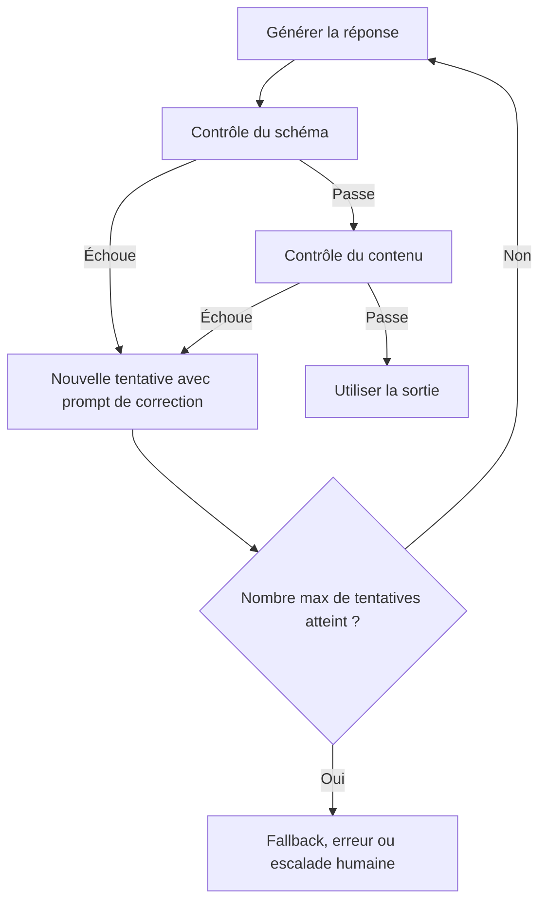

Le modèle renvoie du JSON 95 % du temps. Les 5 % restants, il t’emballe la charge utile dans un petit paragraphe poli et ton job de fond explose à 2 h du matin.

J’ai arrêté d’essayer de “mieux prompter” ça il y a un moment. Si la sortie alimente une écriture en base, un webhook ou une décision visible par un client, le modèle n’a pas le droit d’improviser la forme. Des fonctions comme [Structured Outputs](https://platform.openai.com/docs/guides/structured-outputs) sont le choix sain par défaut, parce qu’elles font respecter un JSON Schema et bloquent les clés obligatoires manquantes ou les valeurs d’enum absurdes. Je valide quand même dans l’app, parce que “ça colle au schéma de transport” et “c’est safe pour ma logique métier”, ce n’est pas du tout la même phrase.

C’est dans cette deuxième couche que les bugs se cachent. Un modèle peut très bien renvoyer `"priority": "urgent"` alors que ton système n’accepte que `low | medium | high`, ou te sortir un résumé vide qui reste techniquement une string. En TypeScript, je choisis [Zod](https://zod.dev/basics) parce que `.safeParse()` me donne la valeur parsée et l’endroit où ça casse d’un seul coup. En Python, [les modèles Pydantic](https://docs.pydantic.dev/latest/concepts/models/) me donnent le même contrat. Si je dois trancher, je préfère un schéma un peu ennuyeux à dix prompts soi-disant malins.

La plupart des guides s’arrêtent à “valider l’objet” et esquivent la partie pénible : le flux de contrôle. C’est la validation qui décide de la suite. Est-ce que tu retentes une fois avec l’erreur exacte ? Est-ce que tu corriges localement un champ sans importance ? Est-ce que tu jettes la réponse et tu alertes quelqu’un ? Si tu sautes cette partie, tu n’as pas un pipeline, tu as une machine à sous avec une super DX.

Quand je dois l’expliquer à une équipe, je dessine d’abord le pipeline pour éviter le grand classique du “bon, c’est invalide, mais on va sûrement s’en sortir quand même” :



Voilà la forme TypeScript que j’expédierais vraiment :

```ts
import { z } from 'zod';

const TicketSummary = z.object({
  sentiment: z.enum(['positive', 'neutral', 'negative']),
  category: z.enum(['billing', 'bug', 'feature', 'account']),
  summary: z.string().min(20).max(280),
  needsHuman: z.boolean(),
});

export function parseTicketSummary(rawText: string) {
  let json: unknown;

  try {
    json = JSON.parse(rawText);
  } catch {
    throw new Error('LLM output is not valid JSON');
  }

  const parsed = TicketSummary.safeParse(json);

  if (parsed.success) return parsed.data;

  throw new Error(
    `Invalid LLM output: ${parsed.error.issues.map((issue) => `${issue.path.join('.')}: ${issue.message}`).join(', ')}`
  );
}
```

J’aime aussi garder la boîte à outils de validation bien visible, parce que tous les échecs ne méritent pas le même marteau :

| Stratégie                  | Quand l’utiliser                                                                                     | Outil / méthode                                                                    |
| -------------------------- | ---------------------------------------------------------------------------------------------------- | ---------------------------------------------------------------------------------- |
| Validation par schéma JSON | La sortie doit être consommée par du code et chaque champ compte vraiment                            | Structured Outputs, JSON Schema, Zod, Pydantic                                     |
| Regex                      | Tu valides juste un motif étroit, comme un identifiant, une date ou un marqueur de citation          | Regex, motifs ancrés, contrôles de chaîne légers                                   |
| LLM-as-judge               | La qualité reste floue et tu as besoin d’une grille sur le ton, l’utilité ou la couverture factuelle | Prompt d’évaluation avec rubrique, juge pairwise, model grader                     |
| Contrôles à base de règles | Les règles métier sont déterministes et peu coûteuses à encoder                                      | Allowlists, bornes numériques, listes de termes interdits, assertions entre champs |
| Revue humaine              | L’action est risquée, ambiguë ou trop chère à rater                                                  | File d’approbation manuelle, escalade support, revue analyste                      |

Ensuite, les règles pratiques. Garde des schémas plus étroits que ton instinct ne le voudrait. Limite les tentatives à une ou deux, parce que “essaie encore” est une excellente façon de cramer des tokens et d’aller flirter avec les rate limits. Loggue la réponse brute quand le parsing échoue, mais nettoie les secrets avant que ça parte dans l’observabilité. Et si tous les champs finissent optionnels, c’est souvent ton prompt ou ton découpage de tâche qui essaie de te dire qu’il déteste la mission.

Ma règle : si la sortie peut déclencher une action, valide-la avec un schéma et décide à l’avance du chemin d’échec. Si elle sert seulement à aider un humain à réfléchir, tu peux te détendre un peu. Dès qu’une mauvaise charge utile peut te réveiller à 3 h du matin, “on rattrapera ça plus tard” cesse d’être un plan sérieux.
