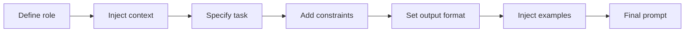

You usually notice you need prompt templates the day one copied prompt starts disagreeing with another, and nobody can tell which version is real anymore.

That is the moment to stop editing raw strings in three places and pick one source of truth. OpenAI’s [prompting guide](https://developers.openai.com/api/docs/guides/prompting) exposes provider-managed prompts with variables and versions, Anthropic’s [prompting tools](https://docs.anthropic.com/en/docs/build-with-claude/prompt-engineering/prompting-tools) describe the same split between fixed instructions and runtime variables, and Anthropic’s [overview](https://docs.anthropic.com/en/docs/build-with-claude/prompt-engineering/overview) explicitly starts from success criteria and evals. My stance is simple: use provider-native prompt management when it fits your workflow, then fall back to file-based templates when you need local review, composition, or cross-provider reuse.

Once the structure is centralized, the next risk is putting decision logic in the template itself. Jinja’s [template docs](https://jinja.palletsprojects.com/en/stable/templates/) support variables, conditionals, loops, includes, and inheritance, which is enough to phrase a task clearly without turning the template into a second application. Keep the rule boring: code decides, templates phrase.

The other trap is security theater. OpenAI’s [safety guide](https://platform.openai.com/docs/guides/safety-best-practices) recommends constraining untrusted input, red-teaming for prompt injection, and keeping a human in the loop for sensitive flows. Delimiters and template variables help you separate instructions from user data, but they do not neutralize hostile text by themselves.

When I review a reusable template, I want to spot the moving parts immediately:

| Template part | Purpose                                                | Example                                        |
| ------------- | ------------------------------------------------------ | ---------------------------------------------- |
| Role          | Tell the model who it should be for this task          | `You are a support analyst`                    |
| Context       | Inject the facts, inputs, or source material it needs  | `Product: Acme Support; Plan: Pro`             |
| Task          | State the exact job to perform                         | `Classify the ticket and draft a reply`        |
| Constraints   | Narrow behavior so the model does not improvise policy | `Do not offer refunds outside the allowlist`   |
| Output format | Make the response shape machine- or reviewer-friendly  | `Return valid JSON with keys: category, reply` |
| Examples      | Show the pattern when wording or structure matters     | `Input: billing issue -> Output: {...}`        |

Before rendering anything from disk, set up the loader once and comment the runtime variables so another reviewer can see what may change per request:

```py
from jinja2 import Environment, FileSystemLoader

env = Environment(
    loader=FileSystemLoader("prompts"),  # folder that stores reusable prompt files
)

template = env.get_template("support_reply.j2")

prompt = template.render(
    product_name="Acme Support",  # fixed product label shown to the model
    allowed_actions=["refund", "replace", "escalate"],  # policy decisions computed in code
    user_message=user_message,  # untrusted user input passed as data, not concatenated text
    tone="concise and warm",  # style variable that can be tested safely
)
```

If you need application-level loading rules, Jinja’s [API docs](https://jinja.palletsprojects.com/en/stable/api/#jinja2.Environment) are the place to check how `Environment`, loaders, and `render()` behave. One detail matters here: explicit configuration is safer than relying on defaults when the rendered output later feeds another system.

When the template grows, I still want the assembly order to stay boring enough that a diff tells me what changed:



Shared templates also make cost drift easier to spot. If one reusable prompt gains fifty tokens, you can measure that once at the shared boundary instead of discovering the same bloat after it has spread across six call sites.

Use a template when the wording repeats across flows, when non-engineers need to review phrasing, or when you want one place to test variable substitutions. Stop and move logic back into code when you need nested business rules, API branching, or policy decisions inside the template.
