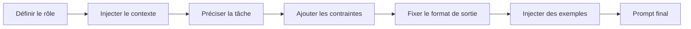

On remarque souvent qu’il faut des templates de prompts le jour où deux copies du même prompt commencent à répondre différemment, sans que personne sache laquelle fait foi.

C’est le moment d’arrêter d’éditer des chaînes brutes à trois endroits et de choisir une seule source de vérité. Le [guide OpenAI](https://developers.openai.com/api/docs/guides/prompting) présente des prompts gérés avec variables et versions, les [outils Anthropic](https://docs.anthropic.com/en/docs/build-with-claude/prompt-engineering/prompting-tools) décrivent la même séparation entre instructions fixes et variables d’exécution, et la [vue d’ensemble Anthropic](https://docs.anthropic.com/en/docs/build-with-claude/prompt-engineering/overview) part explicitement de critères de succès et d’évals. Ma position est simple : utilise d’abord la gestion native du provider quand elle colle à ton workflow, puis passe à des templates dans des fichiers quand tu as besoin de revue locale, de composition ou de réutilisation multi-provider.

Une fois la structure centralisée, le risque suivant est de glisser de la logique de décision dans le template. La [doc Jinja](https://jinja.palletsprojects.com/en/stable/templates/) gère les variables, conditionnels, boucles, inclusions et héritage, ce qui suffit pour formuler une tâche clairement sans transformer le template en deuxième application. Garde une règle très banale : le code décide, le template formule.

L’autre piège, c’est le faux sentiment de sécurité. Le [guide sécurité OpenAI](https://platform.openai.com/docs/guides/safety-best-practices) recommande de borner les entrées non fiables, de faire du red teaming contre la prompt injection et de garder un humain dans la boucle sur les flux sensibles. Les délimiteurs et les variables de template aident à séparer instructions et données utilisateur, mais ils ne neutralisent pas un texte hostile à eux seuls.

Quand je relis un template réutilisable, je veux voir tout de suite ses briques :

| Élément du template | À quoi ça sert                                               | Exemple                                                   |
| ------------------- | ------------------------------------------------------------ | --------------------------------------------------------- |
| Rôle                | Dire au modèle quel rôle il doit prendre pour cette tâche    | `Tu es un analyste support`                               |
| Contexte            | Injecter les faits, entrées ou sources dont il a besoin      | `Produit : Acme Support ; plan : Pro`                     |
| Tâche               | Formuler le travail exact à exécuter                         | `Classifie le ticket et rédige une réponse`               |
| Contraintes         | Borner le comportement pour éviter l’improvisation métier    | `N’accorde aucun remboursement hors allowlist`            |
| Format de sortie    | Rendre la réponse exploitable par du code ou simple à relire | `Retourne un JSON valide avec les clés : category, reply` |
| Exemples            | Montrer le pattern quand la forme ou la structure comptent   | `Entrée : souci de facturation -> Sortie : {...}`         |

Avant de rendre quoi que ce soit depuis le disque, configure le loader une fois et commente les variables d’exécution pour qu’un autre reviewer voie tout de suite ce qui peut changer à chaque requête :

```py
from jinja2 import Environment, FileSystemLoader

env = Environment(
    loader=FileSystemLoader("prompts"),  # dossier qui stocke les fichiers de prompts réutilisables
)

template = env.get_template("support_reply.j2")

prompt = template.render(
    product_name="Acme Support",  # libellé produit fixe montré au modèle
    allowed_actions=["refund", "replace", "escalate"],  # décisions métier calculées dans le code
    user_message=user_message,  # entrée utilisateur non fiable passée comme donnée, pas concaténée
    tone="concise and warm",  # variable de style facile à tester
)
```

Si tu as besoin de règles de chargement côté application, la [doc API Jinja](https://jinja.palletsprojects.com/en/stable/api/#jinja2.Environment) est l’endroit où vérifier le comportement de `Environment`, des loaders et de `render()`. Le point utile ici, c’est qu’une configuration explicite est plus sûre que des valeurs par défaut quand le rendu alimente ensuite un autre système.

Quand le template grossit, je veux quand même un ordre d’assemblage assez banal pour qu’un diff raconte immédiatement ce qui a changé :



Les templates partagés rendent aussi la dérive de coût plus visible. Si un prompt réutilisé prend cinquante tokens, tu peux mesurer l’écart une fois à la frontière commune au lieu de découvrir le même gonflement après sa propagation sur six points d’appel.

Utilise un template quand la formulation se répète entre plusieurs flux, quand des non-développeurs doivent relire le wording sans risque, ou quand tu veux un seul endroit pour tester des substitutions de variables. Arrête-toi et remets la logique dans le code dès que tu commences à écrire des règles métier imbriquées, du branchement API ou des décisions de politique dans le template.
