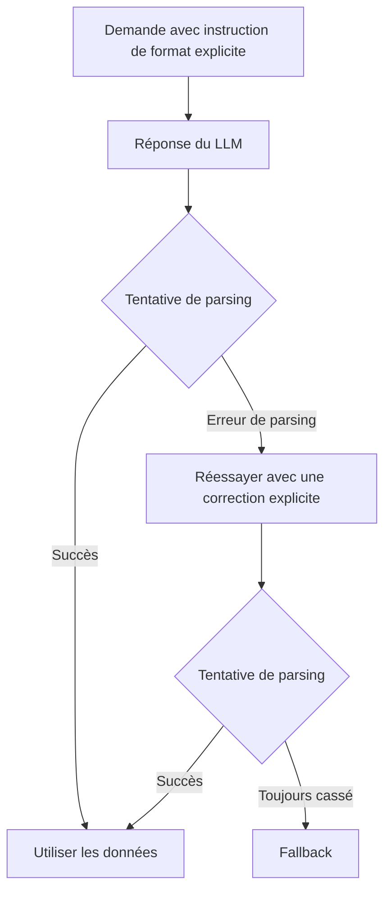

Ton parseur passe tous les tests jusqu’au jour où le modèle invente une valeur d’enum que ton worker n’a jamais vue. Le JSON se parse, le déploiement a l’air propre, et la casse arrive dans le service d’après.

À ce moment-là, j’arrête de demander du “JSON valide” et je définis un contrat. [JSON Schema](https://json-schema.org/overview/what-is-jsonschema) est la bonne base ici, parce que tu peux verrouiller les clés requises, les enums et les objets imbriqués au lieu d’espérer qu’un prompt bien tourné garde la forme stable.

Le principe est proche selon les providers, mais la forme d’API ne l’est pas. Les [Structured Outputs](https://platform.openai.com/docs/guides/structured-outputs) d’OpenAI permettent au Responses API de renvoyer un texte assistant contraint par schéma avec `text.format.type = "json_schema"`, et le même guide rappelle qu’il faut toujours gérer les refus et que la première requête avec un nouveau schéma peut être plus lente. Le [strict tool use](https://docs.anthropic.com/en/docs/agents-and-tools/tool-use/strict-tool-use) d’Anthropic donne la garantie sur les arguments d’outils avec `strict: true` et `input_schema`, ce qui est excellent pour les agents, mais ce n’est pas la même chose que contraindre une réponse libre de l’assistant. Le [structured output](https://ai.google.dev/gemini-api/docs/structured-output) de Gemini passe par un format de réponse avec `mimeType: "application/json"` et un schéma ; dans l’API REST, ça vit sous `generationConfig.responseFormat.text`, donc on est plus proche du modèle OpenAI que du modèle Anthropic.

Si cette distinction te paraît inutilement subtile, tu ne l’inventes pas. Cette différence compte avant de vendre des “structured outputs portables” à une équipe. Si tu as besoin d’un texte assistant typé, OpenAI ou Gemini collent directement au besoin. Si tu as besoin qu’un modèle appelle tes fonctions sans casser la signature, les entrées d’outils strictes d’Anthropic sont un meilleur choix.

Sur OpenAI, voilà la forme que je livrerais vraiment pour une extraction de risque moyen :

```ts
const response = await client.responses.create({
  model: 'gpt-4o-2024-08-06', // exemple de modèle donné dans le guide officiel Structured Outputs
  input: [
    {
      role: 'developer',
      content: 'Extract the ticket summary. If a field is missing in the source, return null instead of guessing.',
    },
    { role: 'user', content: transcript },
  ],
  text: {
    format: {
      type: 'json_schema', // active une sortie texte contrainte par schéma
      name: 'ticket_summary', // nom stable pour ce payload
      strict: true, // impose le respect du schéma
      schema: {
        type: 'object',
        additionalProperties: false,
        properties: {
          sentiment: { type: 'string', enum: ['negative', 'neutral', 'positive'] },
          urgency: { type: 'string', enum: ['low', 'medium', 'high'] },
          product: {
            anyOf: [{ type: 'string' }, { type: 'null' }], // nullable au lieu de deviner
          },
          needs_human: { type: 'boolean' },
        },
        required: ['sentiment', 'urgency', 'product', 'needs_human'],
      },
    },
  },
});

const firstItem = response.output[0]?.content[0];
if (firstItem?.type === 'refusal') throw new Error(firstItem.refusal);

const ticket = JSON.parse(response.output_text);
```

Je garde le schéma plus serré que mon instinct. La [vue d’ensemble du tool use](https://docs.anthropic.com/en/docs/agents-and-tools/tool-use/overview) d’Anthropic précise que les définitions d’outils et les schémas comptent eux-mêmes dans les tokens d’entrée, donc chaque propriété en trop et chaque description verbeuse ont un coût réel. C’est une bonne raison de limiter les retries, de nettoyer les secrets avant de logger un payload cassé, et de s’arrêter après une tentative de réparation au lieu de transformer la validation en fuite de budget.

Pour choisir un format de sortie, j'utilise une règle très ennuyeuse : prendre le format le plus faible qui donne encore un parsing fiable.

| Format             | Cas d'usage                                                     | Librairie de parsing             | Risque                                                                            |
| ------------------ | --------------------------------------------------------------- | -------------------------------- | --------------------------------------------------------------------------------- |
| JSON               | Objets ou tableaux simples avec une validation légère.          | `JSON.parse` puis Zod ou Valibot | Facile à parser, donc facile à croire trop vite.                                  |
| JSON Schema        | Contrats stricts avec enums, champs requis et objets imbriqués. | Ajv                              | Plus de setup, plus de dépendance au provider, mais une frontière bien plus sûre. |
| XML                | Intégrations legacy ou contenus mixtes avec attributs.          | `fast-xml-parser`                | Verbeux et étonnamment facile à casser côté prompt.                               |
| Markdown           | Réponses pensées pour l'humain, avec juste assez de structure.  | `remark`                         | Propre à lire, flou à parser dès que les titres ou les listes bougent.            |
| CSV                | Lignes tabulaires à envoyer dans un tableur ou un outil BI.     | `csv-parse`                      | Casse vite dès qu'il y a des virgules, des guillemets ou du multiligne.           |
| texte brut + regex | Micro-extractions où l'échec reste acceptable.                  | `RegExp` natif                   | Fragile par défaut ; un changement de formulation peut tout casser.               |

Et voilà la boucle opérationnelle en laquelle j'ai vraiment confiance en production :



Mon seuil est simple. Si le code en aval branche sur un champ, paie la taxe du schéma dès le premier jour. Si la sortie sert seulement à aider un humain à réfléchir et qu'un mauvais enum ne déclenche aucune automatisation, du JSON simple suffit souvent.
