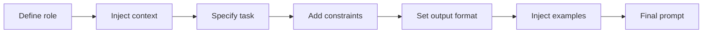

The first version of a prompt lives in one file. Two weeks later it exists in five places, each with one tiny tweak, and nobody knows which copy is responsible for the regression. That is not prompting anymore, that is configuration drift wearing a fake moustache.

Prompt templates fix that, but only if you treat them as reusable assets, not as a place to hide application logic. Jinja’s [template docs](https://jinja.palletsprojects.com/en/stable/templates/) give you variables, conditionals, includes, and proper rendering mechanics, which is enough for most LLM workloads. OpenAI’s [prompting guide](https://developers.openai.com/api/docs/guides/prompting) and Anthropic’s [prompt engineering overview](https://docs.anthropic.com/en/docs/build-with-claude/prompt-engineering/overview) push the same operational habit: iterate on prompts deliberately instead of treating them like magic spells.

What most tutorials miss is the failure mode. Once prompts become templates, developers start sneaking business rules into them. A bit of conditional logic becomes a nested maze, and suddenly the prompt layer is making product decisions that your tests do not even cover. I prefer a boring rule: code decides, templates phrase.

I also keep user input in clearly delimited variables. OpenAI’s [prompt injection write-up](https://openai.com/index/prompt-injections/) is a good reminder that separation helps with accidental collisions and audits, but it does not make hostile input safe by itself.

When I review a reusable template, I want to see the moving parts immediately:

| Template Part | Purpose                                                    | Example                                        |
| ------------- | ---------------------------------------------------------- | ---------------------------------------------- |
| Role          | Tell the model who it is supposed to be for this task      | `You are a support analyst`                    |
| Context       | Inject the facts, inputs, or source material it needs      | `Product: Acme Support; Plan: Pro`             |
| Task          | State the exact job to perform                             | `Classify the ticket and draft a reply`        |
| Constraints   | Narrow the behavior so the model does not improvise policy | `Do not offer refunds outside the allowlist`   |
| Output format | Make the response shape machine- or reviewer-friendly      | `Return valid JSON with keys: category, reply` |
| Examples      | Show the pattern when wording or structure matters         | `Input: billing issue -> Output: {...}`        |

This is the kind of template setup I actually like:

```py
from jinja2 import Environment, FileSystemLoader

env = Environment(loader=FileSystemLoader("prompts"))
template = env.get_template("support_reply.j2")

prompt = template.render(
    product_name="Acme Support",
    allowed_actions=["refund", "replace", "escalate"],
    user_message=user_message,
    tone="concise and warm",
)
```

And when the template grows, I like the assembly order to stay boring and reusable:



The template itself should stay readable enough that a reviewer can spot a risky change in one diff. If I need loops, conditionals, and includes, fine. If I need comments to explain what the template is thinking, I have already pushed too much logic into the wrong layer.

Templates also help with cost control because they reduce accidental prompt sprawl. A reused system prompt that grows by fifty tokens in one place is manageable. The same drift copied across six services becomes a slow tax you keep paying forever.

My threshold is pretty strict. Use templates when the same prompt structure appears in more than one code path, or when non-engineers need to review wording safely. If your template starts looking like a tiny programming language, stop being proud of it and move the logic back into code.
