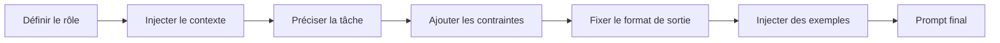

La première version d’un prompt vit dans un seul fichier. Deux semaines plus tard, il existe à cinq endroits, avec une petite variation à chaque fois, et plus personne ne sait quelle copie a introduit la régression. À ce stade, on n’est plus dans le prompting, on est dans la dérive de configuration avec une moustache collée.

Les templates de prompts règlent ce problème, mais seulement si tu les traites comme des assets réutilisables, pas comme une planque pour la logique applicative. La [documentation Jinja](https://jinja.palletsprojects.com/en/stable/templates/) t’apporte des variables, des conditionnels, des inclusions et un vrai moteur de rendu, ce qui suffit largement à la plupart des usages LLM. Le [guide de prompting OpenAI](https://developers.openai.com/api/docs/guides/prompting) et la [vue d’ensemble Anthropic](https://docs.anthropic.com/en/docs/build-with-claude/prompt-engineering/overview) poussent la même habitude utile : itérer sur ses prompts volontairement au lieu de les traiter comme des formules magiques.

Ce que les tutos racontent moins, c’est le mode de panne. Dès qu’un prompt devient un template, on commence à y glisser des règles métier. Un peu de logique conditionnelle devient un petit labyrinthe, puis la couche prompt se met à prendre des décisions produit que tes tests ne couvrent même pas. Ma règle préférée est très banale : le code décide, le template formule.

Je garde aussi les entrées utilisateur dans des variables bien délimitées. L’[article OpenAI sur la prompt injection](https://openai.com/index/prompt-injections/) rappelle bien que cette séparation limite les collisions accidentelles et simplifie les audits, mais qu’elle ne rend pas un texte hostile inoffensif par magie.

Quand je relis un template réutilisable, je veux voir tout de suite ses briques :

| Élément du template | À quoi ça sert                                               | Exemple                                                   |
| ------------------- | ------------------------------------------------------------ | --------------------------------------------------------- |
| Rôle                | Dire au modèle quel “métier” il doit jouer pour cette tâche  | `Tu es un analyste support`                               |
| Contexte            | Injecter les faits, entrées ou sources dont il a besoin      | `Produit : Acme Support ; plan : Pro`                     |
| Tâche               | Formuler le travail exact à exécuter                         | `Classifie le ticket et rédige une réponse`               |
| Contraintes         | Borner le comportement pour éviter l’improvisation métier    | `N’accorde aucun remboursement hors allowlist`            |
| Format de sortie    | Rendre la réponse exploitable par du code ou simple à relire | `Retourne un JSON valide avec les clés : category, reply` |
| Exemples            | Montrer le pattern attendu quand la forme compte             | `Entrée : souci de facturation -> Sortie : {...}`         |

Voici le genre de setup que j’aime vraiment garder en prod :

```py
from jinja2 import Environment, FileSystemLoader

env = Environment(loader=FileSystemLoader("prompts"))
template = env.get_template("support_reply.j2")

prompt = template.render(
    product_name="Acme Support",
    allowed_actions=["refund", "replace", "escalate"],
    user_message=user_message,
    tone="concise and warm",
)
```

Et quand le template grossit, j’aime garder un ordre d’assemblage bête et réutilisable :



Le template lui-même doit rester assez lisible pour qu’un reviewer voie un changement risqué en un diff. Si j’ai besoin de boucles, de conditionnels et d’inclusions, très bien. Si j’ai besoin de commentaires pour expliquer ce que le template essaye de penser, c’est que j’ai déjà poussé trop de logique dans la mauvaise couche.

Les templates aident aussi à contrôler les coûts parce qu’ils réduisent la prolifération accidentelle des prompts. Un prompt système réutilisé qui grossit de cinquante tokens à un endroit, ça se surveille. La même dérive copiée dans six services devient une taxe lente que tu paies indéfiniment.

Mon seuil est assez strict. Utilise des templates quand la même structure de prompt apparaît dans plusieurs chemins de code, ou quand des non-développeurs doivent pouvoir relire la formulation sans danger. Si ton template commence à ressembler à un mini langage de programmation, arrête de l’admirer et remets la logique dans le code.
