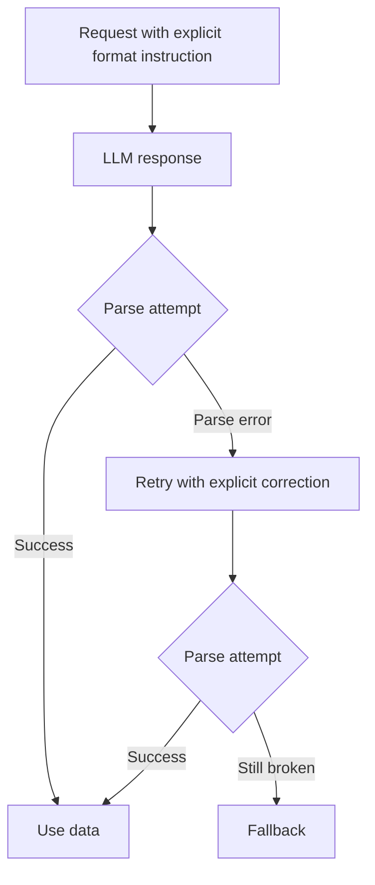

Valid JSON feels like a victory until one missing enum takes down the next service. I learned that the annoying way: the parser was happy, TypeScript was happy, and the business rule still exploded because `"priority": "urgent-ish"` was not a value anybody had agreed to support.

Structured outputs are what I reach for when the backend depends on shape, not just syntax. OpenAI’s [structured outputs guide](https://platform.openai.com/docs/guides/structured-outputs) lets you attach a JSON Schema and ask the model to return data that matches it. The win is not cosmetic. You move the contract from fuzzy prompt prose into a machine-checkable interface.

That changes how you think about prompting. The [JSON Schema overview](https://json-schema.org/overview/what-is-jsonschema) is worth reading because the moment you define enums, required properties, and nested objects, you are not “just prompting” anymore. You are designing an API boundary, and schema mistakes usually outlive prompt wording.

The part most people skip is the refusal branch. Structured outputs do not force the model to comply with unsafe or impossible requests, so your code still needs a real fallback path. Another operational detail from the docs matters in production: the first request with a new schema can add latency while the schema is processed. That is fine for internal tools, less funny on a hot path you forgot to warm up.

This is the kind of call I use when a typed payload is non-negotiable:

```ts
const response = await client.responses.create({
  model: 'gpt-4.1',
  input: 'Classify this lead based on the transcript.',
  text: {
    format: {
      type: 'json_schema',
      name: 'lead_classifier',
      strict: true,
      schema: {
        type: 'object',
        additionalProperties: false,
        properties: {
          segment: { type: 'string', enum: ['startup', 'agency', 'enterprise'] },
          priority: { type: 'string', enum: ['low', 'medium', 'high'] },
          needs_demo: { type: 'boolean' },
        },
        required: ['segment', 'priority', 'needs_demo'],
      },
    },
  },
});
```

When choosing an output format, I use a very boring rule: pick the weakest format that still gives me reliable parsing.

| Format                | Use Case                                                          | Parsing Library                  | Risk                                                           |
| --------------------- | ----------------------------------------------------------------- | -------------------------------- | -------------------------------------------------------------- |
| JSON                  | Simple objects or arrays with light validation.                   | `JSON.parse` plus Zod or Valibot | Easy to parse, easy to trust too early.                        |
| JSON Schema           | Strict contracts with enums, required fields, and nested objects. | Ajv                              | More setup, more provider coupling, but much safer boundaries. |
| XML                   | Legacy integrations or mixed content with attributes.             | `fast-xml-parser`                | Verbose and surprisingly easy to get wrong in prompts.         |
| Markdown              | Human-facing responses that still need lightweight structure.     | `remark`                         | Looks neat while hiding ambiguity in headings or lists.        |
| CSV                   | Flat tabular rows you want to drop into spreadsheets or BI tools. | `csv-parse`                      | Breaks fast when commas, quoting, or multiline fields show up. |
| plain text with regex | Tiny extraction tasks where failure is acceptable.                | native `RegExp`                  | Fragile by default; one wording change can kill the parser.    |

And this is the operational loop I actually trust in production:



I still keep the prompt itself boring and explicit. OpenAI’s [prompt engineering guide](https://platform.openai.com/docs/guides/prompt-engineering) still applies: clear instructions and good examples matter even when the output is typed. A schema prevents structural drift, not semantic stupidity.

The useful comparison is OpenAI’s [JSON mode guide](https://platform.openai.com/docs/guides/text-generation#json-mode). JSON mode solves parseability. Structured outputs solve parseability plus schema adherence. That extra guarantee costs some setup and some provider coupling, but it saves a lot of defensive code once your system starts depending on exact fields.

My threshold is blunt. The moment downstream code branches on keys, enums, or required fields, pay the schema tax up front. Free-form text is fun for demos. Contracts are what survive contact with production.
