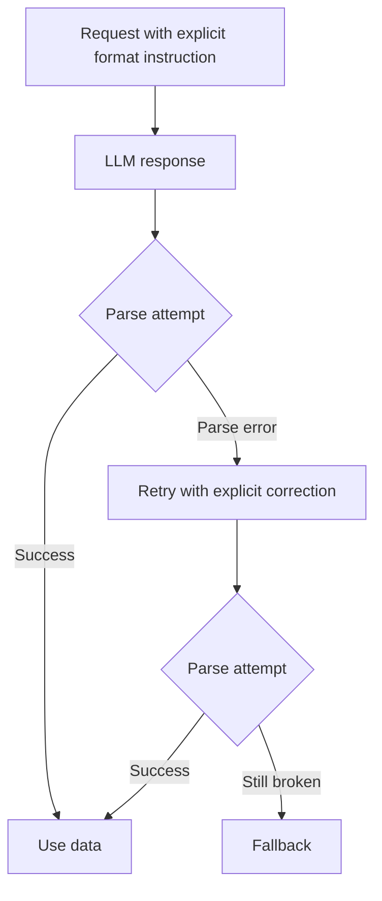

Your parser passes every test until the model invents one enum value your queue worker has never seen. The JSON parses, the deploy looks green, and the failure lands in the next service.

That is when I stop asking for “valid JSON” and start defining a contract. [JSON Schema](https://json-schema.org/overview/what-is-jsonschema) is the useful baseline here because it lets you lock required keys, enums, and nested objects instead of hoping prompt wording keeps the shape stable.

Provider support is similar in spirit, but not in API shape. OpenAI’s [Structured Outputs](https://platform.openai.com/docs/guides/structured-outputs) let the Responses API return schema-constrained assistant text with `text.format.type = "json_schema"`, and the same guide is clear that you still need to handle refusals and that the first request with a new schema can be slower. Anthropic’s [strict tool use](https://docs.anthropic.com/en/docs/agents-and-tools/tool-use/strict-tool-use) gives the guarantee on tool arguments with `strict: true` plus an `input_schema`, which is excellent for agents but not the same thing as constraining arbitrary assistant prose. Gemini’s [structured output](https://ai.google.dev/gemini-api/docs/structured-output) uses a response format with `mimeType: "application/json"` plus a schema; in the REST API, that sits under `generationConfig.responseFormat.text`, so it is closer to the OpenAI pattern than the Anthropic one.

If that distinction feels annoyingly subtle, you are not imagining it. That difference matters before you promise “portable structured outputs” to a team. If you need typed assistant text, OpenAI or Gemini fit directly. If you need a model to call your functions safely, Anthropic’s strict tool inputs are the tighter match.

On OpenAI, this is the shape I would actually ship for a medium-risk extraction task:

```ts
const response = await client.responses.create({
  model: 'gpt-4o-2024-08-06', // example model from the official Structured Outputs guide
  input: [
    {
      role: 'developer',
      content: 'Extract the ticket summary. If a field is missing in the source, return null instead of guessing.',
    },
    { role: 'user', content: transcript },
  ],
  text: {
    format: {
      type: 'json_schema', // turn on schema-constrained text output
      name: 'ticket_summary', // stable name for this payload
      strict: true, // require schema adherence
      schema: {
        type: 'object',
        additionalProperties: false,
        properties: {
          sentiment: { type: 'string', enum: ['negative', 'neutral', 'positive'] },
          urgency: { type: 'string', enum: ['low', 'medium', 'high'] },
          product: {
            anyOf: [{ type: 'string' }, { type: 'null' }], // nullable instead of guessed
          },
          needs_human: { type: 'boolean' },
        },
        required: ['sentiment', 'urgency', 'product', 'needs_human'],
      },
    },
  },
});

const firstItem = response.output[0]?.content[0];
if (firstItem?.type === 'refusal') throw new Error(firstItem.refusal);

const ticket = JSON.parse(response.output_text);
```

I keep the schema tighter than my instinct. Anthropic’s [tool use overview](https://docs.anthropic.com/en/docs/agents-and-tools/tool-use/overview) notes that tool definitions and schemas themselves count toward input tokens, so every extra property and verbose description has a real cost. That is one more reason to cap retries, scrub secrets before logging broken payloads, and stop after one repair attempt instead of turning validation into a budget leak.

When choosing an output format, I use a very boring rule: pick the weakest format that still gives me reliable parsing.

| Format                | Use Case                                                          | Parsing Library                  | Risk                                                           |
| --------------------- | ----------------------------------------------------------------- | -------------------------------- | -------------------------------------------------------------- |
| JSON                  | Simple objects or arrays with light validation.                   | `JSON.parse` plus Zod or Valibot | Easy to parse, easy to trust too early.                        |
| JSON Schema           | Strict contracts with enums, required fields, and nested objects. | Ajv                              | More setup, more provider coupling, but much safer boundaries. |
| XML                   | Legacy integrations or mixed content with attributes.             | `fast-xml-parser`                | Verbose and surprisingly easy to get wrong in prompts.         |
| Markdown              | Human-facing responses that still need lightweight structure.     | `remark`                         | Looks neat while hiding ambiguity in headings or lists.        |
| CSV                   | Flat tabular rows you want to drop into spreadsheets or BI tools. | `csv-parse`                      | Breaks fast when commas, quoting, or multiline fields show up. |
| plain text with regex | Tiny extraction tasks where failure is acceptable.                | native `RegExp`                  | Fragile by default; one wording change can kill the parser.    |

And this is the operational loop I actually trust in production:



My cutoff is simple. If downstream code branches on a field, pay the schema tax on day one. If the output only helps a human think and a wrong enum cannot trigger automation, plain JSON is usually enough.
