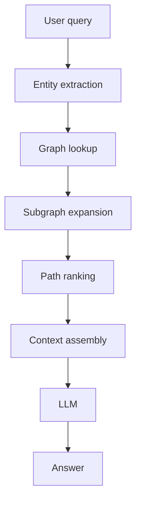

Flat retrieval fails in a way architects hate: the answer is in the corpus, but it sits behind two or three relationships your retriever never walks. “Which supplier shares a region with the component that failed last quarter, and which contracts mention that dependency?” is not a chunk-ranking miss. It is a relationship miss.

I would not reach for Graph RAG until semantic search, metadata filters, and a second retrieval pass are already losing on a real eval set. [Microsoft GraphRAG](https://microsoft.github.io/graphrag/) is built around extracting entities and relationships, clustering them into communities, and using those structures at query time. That only pays off when your failures are genuinely multi-hop. Otherwise you are building a graph to compensate for weak retrieval hygiene.

The ugly part is ingestion, not prompting. If you cannot keep entity IDs stable, constrain relation extraction, and re-index without turning one customer into three near-duplicates, the graph will rot faster than the documents it came from. [PropertyGraphIndex](https://docs.llamaindex.ai/en/stable/module_guides/indexing/lpg_index_guide/) is useful because it exposes `kg_extractors`, strict schema validation, and multiple retrievers instead of pretending extraction is solved. For the storage and retrieval layer, I would rather use a first-party graph stack than invent one from scratch, and [Neo4j GraphRAG](https://neo4j.com/docs/neo4j-graphrag-python/current/) is explicit about its RAG and knowledge-graph builder components.

When I do ship it, I want the runtime path visible before anyone starts hand-waving about “graph intelligence”:



Then the implementation still has to stay boring and measurable:

```ts
async function answerWithGraph(question: string) {
  const entities = await extractEntities(question);
  const subgraph = await graphStore.expand({
    entities,
    maxDepth: 2,
    edgeTypes: ['owns', 'depends_on', 'located_in'],
  });

  const evidence = await rankSubgraphFacts(question, subgraph);
  return generator.answer({ question, evidence: evidence.slice(0, 12) });
}
```

That `maxDepth: 2` is not stylistic. It is an SLA control. Microsoft's own [query modes](https://microsoft.github.io/graphrag/query/overview/) keep graph search next to a plain Basic Search path because some questions should stay cheap. In production I log traversal depth, node count, edge count, retrieved fact count, and whether the final answer used graph evidence at all. If graph traversal is not changing answer quality, take it out of the hot path.

I only approve Graph RAG when at least roughly 10% of production-like eval failures are clearly relational: missing edge, wrong hop, or orphaned entity. Below that, fix chunking, filters, reranking, or add one more retrieval pass. Graphs are for repeated relationship failures, not for making a basic RAG demo look expensive.
