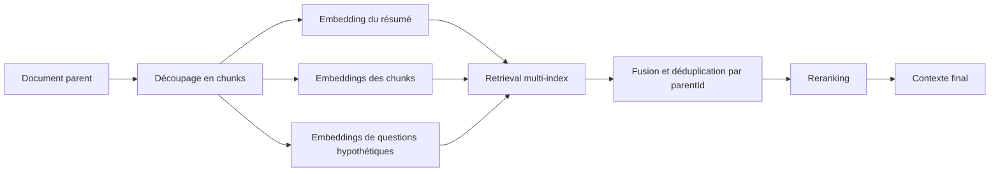

La recherche à vecteur unique a l'air bête après ton cinquième quasi-échec en production. La phrase existe, l'évaluateur la surligne, pourtant l'embedding du chunk se fait noyer par le texte voisin et n'arrive jamais dans le prompt. Le RAG multi-vecteur sert à corriger exactement ce raté-là. Si ton jeu d'évaluation ne montre pas ce motif, laisse tomber.

La vraie ligne de fracture est architecturale. [ColBERT](https://github.com/stanford-futuredata/ColBERT) conserve une matrice d'embeddings au niveau des tokens pour chaque passage et score avec une interaction tardive plus MaxSim, donc les correspondances étroites survivent au lieu d'être moyennées. [ColBERTv2](https://aclanthology.org/2022.naacl-main.272/) réduit l'empreinte mémoire de 6 à 10x, mais le chemin de serving reste plus lourd. Plus de vecteurs, plus de pression mémoire, une recherche plus coûteuse, et des revues d'incident plus pénibles quand le rappel baisse.

C'est pour ce coût supplémentaire que je sépare deux patterns que beaucoup mélangent paresseusement. Le premier est la vraie interaction tardive. Le second est l'indexation multi-représentation au niveau applicatif : plusieurs vecteurs enfants pour un même document parent, par exemple un résumé, des questions synthétiques et le passage d'origine. Le [guide ColBERT de Qdrant](https://qdrant.tech/documentation/fastembed/fastembed-colbert/) dit l'essentiel sans détour : l'interaction tardive achète de la précision, mais elle sert souvent mieux après une première shortlist dense, parce que la vitesse et la mémoire se dégradent vite.

Voilà le schéma minimal que je veux voir dans la tête des équipes avant qu'elles codent ça :



Quand j'utilise le pattern le moins cher, je rends le contrat parent-enfant impossible à ignorer :

```ts
type ChildVector = {
  childId: string;
  parentId: string;
  kind: 'passage' | 'summary' | 'question';
  embedding: number[];
  text: string;
};

async function retrieveParentDocs(query: string) {
  const childHits = await multiVectorIndex.search(query, { topK: 30 });
  const grouped = groupBy(childHits, (hit) => hit.parentId);

  return Object.values(grouped)
    .map((hits) => scoreParent(hits))
    .sort((a, b) => b.score - a.score)
    .slice(0, 6);
}
```

Ce `parentId` est l'endroit où les équipes se mentent le plus. Un excellent hit enfant ne sert à rien si la génération ne voit que ce fragment. Réhydrater le parent complet règle la perte de contexte, mais remet aussi du bruit dans le prompt. Je choisis la fenêtre d'expansion à partir du SLA, pas par goût esthétique. En conformité, une fenêtre parent plus large se défend ; en recherche support, le plus souvent non.

L'index exige aussi une observabilité que les systèmes mono-vecteur esquivent souvent. Les [multivecteurs de Qdrant](https://qdrant.tech/documentation/concepts/vectors/#multivectors) permettent de stocker plusieurs vecteurs par point, et [Vespa](https://docs.vespa.ai/en/embedding.html) montre la même réalité côté serving : dès que tu indexes des tableaux de textes dans des tenseurs multi-vecteurs, la mémoire grimpe et la latence d'ingestion peut monter aussi. Surveille donc le nombre moyen de vecteurs enfants par parent, la latence p95 de retrieval, le taux d'écrasement par `parentId`, et la part des hits enfants qui disparaissent après agrégation parent. Si tu ne sais pas expliquer ces quatre métriques pendant un incident, tu n'es pas prêt pour ce pattern.

Ma règle est simple : j'adopte le RAG multi-vecteur seulement quand la recherche mono-vecteur rate encore des passages étroits et à forte valeur après avoir corrigé le chunking, les filtres de métadonnées, la recherche hybride et le reranking. Si tu n'échoues pas sur des preuves exactes et un rappel serré, c'est de la complexité gaspillée. Si ton budget de latence est déjà tendu, c'est probablement le mauvais choix même quand le gain qualité a l'air réel.
