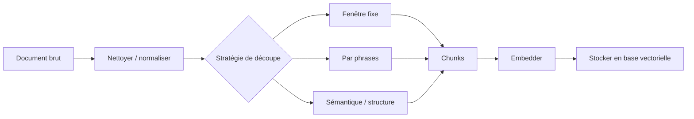

Ta recherche vectorielle remonte toujours quelque chose. Souvent le mauvais paragraphe. Le problème vient rarement du modèle d'embedding. Il apparaît au moment où tu sépares un titre de son tableau, où tu détaches un label de speaker de la réponse, ou où tu coupes un bloc de code en deux.

Moi, je découpe d'abord par structure, ensuite par budget de tokens. En Markdown, je prends [MarkdownHeaderTextSplitter](https://docs.langchain.com/oss/python/integrations/splitters/markdown_header_metadata_splitter) parce qu'il groupe le contenu par titres et conserve cette hiérarchie dans les métadonnées. Quand la source a déjà perdu sa forme, [RecursiveCharacterTextSplitter](https://docs.langchain.com/oss/python/integrations/splitters/recursive_text_splitter) devient mon filet de secours parce qu'il essaie d'abord les gros séparateurs avant de hacher le texte trop tôt.

Le piège dans lequel je suis tombé, c'était de traiter Markdown, HTML, transcription et texte OCR comme un seul blob générique. Ce n'est pas le même travail. Les [node parsers LlamaIndex](https://docs.llamaindex.ai/en/stable/module_guides/loading/node_parsers/) héritent déjà des attributs du document vers les nœuds enfants, donc le chunking orienté format fait partie du modèle d'ingestion. Je normalise d'abord, puis je choisis le splitter le moins coûteux qui préserve encore la frontière qu'un humain juge importante.

Cette décision devient simple à tenir avec un petit dispatcher avant même de brancher une abstraction de framework. Dans ma tête, le pipeline ressemble à ça.



```ts
type SourceKind = 'markdown' | 'html' | 'transcript' | 'plain';

export function chunkDocument(input: { kind: SourceKind; text: string }) {
  if (input.kind === 'markdown') {
    return chunkMarkdownByHeading(input.text, {
      maxTokens: 400, // garde de la marge pour les titres et le prompt de retrieval
      keepHeading: true, // le titre porte souvent une partie du sens
      preserveCodeBlocks: true, // couper un bloc fenced trop tôt casse la recherche
    });
  }

  if (input.kind === 'html') {
    return chunkHtmlBySection(input.text, {
      allowedTags: ['h1', 'h2', 'h3', 'p', 'li', 'pre'],
      maxTokens: 400, // on ne recurse que dans une section encore trop grosse
    });
  }

  if (input.kind === 'transcript') {
    return chunkTranscriptBySpeaker(input.text, {
      maxTokens: 300, // tours plus courts, mais labels de speaker obligatoires
      mergeShortTurns: true, // évite les chunks d'une ligne sans sens autonome
    });
  }

  return recursiveChunk(input.text, {
    maxTokens: 350,
    overlapTokens: 40, // assez de continuité sans payer deux fois tout le texte
    separators: ['\n\n', '\n', '. ', ' '],
  });
}
```

Une fois les frontières propres, je fais quand même en sorte que chaque chunk s'explique tout seul. Les [modules de parsers LlamaIndex](https://docs.llamaindex.ai/en/stable/module_guides/loading/node_parsers/modules/) rappellent que le contexte voisin peut vivre dans les métadonnées et qu'une partie de ces métadonnées de fenêtre n'est pas visible par le LLM ni par le modèle d'embedding, donc je préfixe le titre parent ou le nom du speaker dans le texte indexé au lieu de parier uniquement sur les métadonnées.

C'est aussi là que le coût, les limites de débit et la sécurité deviennent concrets. Le guide [OpenAI embeddings](https://platform.openai.com/docs/guides/embeddings) précise que les embeddings sont facturés au token d'entrée et limités par une taille maximale d'entrée, donc un overlap agressif n'est jamais gratuit. Multiplier les micro-chunks augmente aussi le nombre de requêtes et fait apparaître plus vite les quotas du fournisseur. Et comme c'est bien le texte complet du chunk qui part vers l'API d'embedding, je retire les secrets, clés d'API et identifiants client avant l'indexation.

Si je dois trancher vite, je pars sur des chunks structurés de 300 à 500 tokens, un overlap sous environ 10 %, et je ne recurse que lorsqu'une seule section dépasse encore le budget. Dès que tu as besoin de 20 % d'overlap pour sauver la qualité des réponses, arrête d'ajuster le modèle et corrige tes frontières de chunking.
