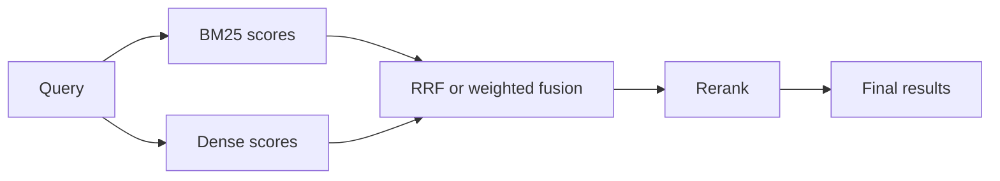

Semantic search feels smart until a user pastes `ERR-8492`, a contract clause, or an internal SKU. Then the dense retriever that looked great in demos misses the only chunk that matters, and plain keyword search suddenly looks like the adult in the room.

I would not reach for hybrid search on day one. First I check whether chunking, metadata, or missing aliases already explain the misses. I add hybrid only when the failures are clearly exact-match problems: identifiers, rare acronyms, and wording where [BM25](https://www.elastic.co/guide/en/elasticsearch/reference/current/index-modules-similarity.html) should dominate while dense retrieval still handles paraphrases.

Once that pattern is real, I want a backend that already exposes both signals. [Pinecone hybrid](https://docs.pinecone.io/guides/search/hybrid-search) combines dense and lexical search, and [Weaviate hybrid](https://docs.weaviate.io/weaviate/search/hybrid) combines vector search with BM25F. I still avoid weighted score merging as my default, because score ranges drift across systems and Pinecone explicitly warns that dense and sparse values are not normalized in the same range. My first choice is [RRF](https://www.elastic.co/guide/en/elasticsearch/reference/current/rrf.html), because it merges rank positions without pretending the raw scores are comparable.

Before I touch the implementation, I want the trade-off table visible:

| Method              | Strengths                                                | Weaknesses                                              | Best For                                                   |
| ------------------- | -------------------------------------------------------- | ------------------------------------------------------- | ---------------------------------------------------------- |
| BM25                | Excellent on exact terms, identifiers, clauses, acronyms | Misses paraphrases and semantic similarity              | Error codes, SKUs, legal clauses, rare jargon              |
| Dense vector search | Strong on paraphrases and conceptual similarity          | Weak on exact-match needles and opaque identifiers      | Natural-language questions, fuzzy phrasing                 |
| Hybrid              | Covers both lexical and semantic misses in one pipeline  | More moving parts, harder scoring, easier latency creep | Mixed corpora where both exact match and paraphrase matter |

This is the shape I would ship first, before adding rerankers or more knobs:

```ts
type HybridSearchArgs = {
  query: string;
  tenantId: string;
  limit?: number;
};

async function hybridSearch({ query, tenantId, limit = 8 }: HybridSearchArgs) {
  const candidateCount = 20; // small pool keeps latency and rerank cost under control

  const [denseHits, sparseHits] = await Promise.all([
    vectorStore.search(query, {
      topK: candidateCount, // semantic recall for paraphrases
      filter: { tenantId }, // enforce access scope before fusion
    }),
    keywordStore.search(query, {
      topK: candidateCount, // exact-match recall for codes and acronyms
      filter: { tenantId }, // apply the same boundary on both retrievers
    }),
  ]);

  const merged = reciprocalRankFusion([{ hits: denseHits }, { hits: sparseHits }], { rankConstant: 60 });

  return merged.slice(0, limit);
}
```

And if someone on the team still thinks “hybrid” means “average two numbers,” this is the flow I put on the whiteboard:



Keep the candidate pool tight. The moment you push both retrievers to `topK=100`, you pay for it in latency, reranker spend, and debugging time. I also treat query-time filtering as non-negotiable: [Pinecone filters](https://docs.pinecone.io/guides/search/filter-by-metadata) and [Weaviate filters](https://docs.weaviate.io/weaviate/search/filters) both let you enforce tenant or access boundaries before results are fused, which is safer than filtering after the fact.

My rule is blunt: stay vector-only until exact-match misses show up repeatedly in eval logs, then add hybrid with RRF and a small candidate pool. If hybrid only looks good after lots of weighting tricks, your retrieval stack is asking for better chunking, metadata, or synonym handling instead.
