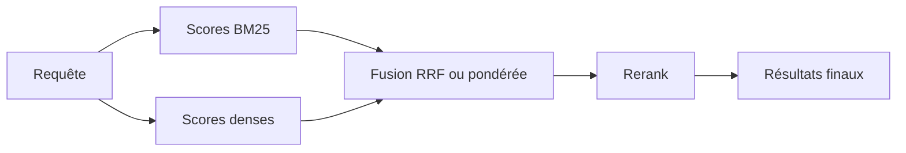

La recherche sémantique paraît brillante jusqu'au jour où un utilisateur colle `ERR-8492`, une clause contractuelle ou un SKU interne. À ce moment-là, le retriever dense qui brillait en démo rate le seul chunk utile, et la vieille recherche par mots-clés reprend soudain un air très adulte.

Je ne choisis pas la recherche hybride dès le premier jour. Je vérifie d'abord si le chunking, les métadonnées ou des alias manquants expliquent déjà les ratés. Je l'ajoute seulement quand les échecs sont clairement des problèmes d'exact match : identifiants, acronymes rares et formulations où [BM25](https://www.elastic.co/guide/en/elasticsearch/reference/current/index-modules-similarity.html) doit prendre l'avantage, pendant que la recherche dense continue de gérer les paraphrases.

Quand ce motif apparaît vraiment, je veux un backend qui expose déjà les deux signaux. [Pinecone hybrid](https://docs.pinecone.io/guides/search/hybrid-search) combine recherche dense et lexicale, et [Weaviate hybrid](https://docs.weaviate.io/weaviate/search/hybrid) combine recherche vectorielle et BM25F. En revanche, je n'utilise pas la fusion par score pondéré comme choix par défaut, parce que les plages de scores dérivent d'un système à l'autre et Pinecone avertit explicitement que les valeurs denses et creuses ne sont pas normalisées sur la même échelle. Mon premier choix reste [RRF](https://www.elastic.co/guide/en/elasticsearch/reference/current/rrf.html), parce qu'il fusionne des positions de rang au lieu de faire semblant que les scores bruts sont comparables.

Avant même de toucher à l’implémentation, je veux avoir le tableau des compromis sous les yeux :

| Méthode                     | Forces                                                              | Faiblesses                                                                   | Idéal pour                                                         |
| --------------------------- | ------------------------------------------------------------------- | ---------------------------------------------------------------------------- | ------------------------------------------------------------------ |
| BM25                        | Excellent sur les termes exacts, identifiants, clauses et acronymes | Rate les paraphrases et la similarité sémantique                             | Codes d’erreur, SKU, clauses juridiques, jargon rare               |
| Recherche vectorielle dense | Très bonne sur les paraphrases et la proximité conceptuelle         | Faible dès qu’il faut retrouver une aiguille exacte ou un identifiant opaque | Questions en langage naturel, formulations floues                  |
| Hybride                     | Couvre à la fois les ratés lexicaux et sémantiques                  | Plus de pièces mobiles, scoring plus pénible, latence qui dérive vite        | Corpus mixtes où exact match et paraphrases comptent tous les deux |

Voici la forme que je mettrais en prod d'abord, avant d'ajouter un reranker ou plus de réglages :

```ts
type HybridSearchArgs = {
  query: string;
  tenantId: string;
  limit?: number;
};

async function hybridSearch({ query, tenantId, limit = 8 }: HybridSearchArgs) {
  const candidateCount = 20; // petit pool pour garder la latence et le coût du rerank sous contrôle

  const [denseHits, sparseHits] = await Promise.all([
    vectorStore.search(query, {
      topK: candidateCount, // rappel sémantique pour les paraphrases
      filter: { tenantId }, // applique le périmètre d'accès avant la fusion
    }),
    keywordStore.search(query, {
      topK: candidateCount, // rappel exact pour les codes et les acronymes
      filter: { tenantId }, // applique la même frontière côté BM25
    }),
  ]);

  const merged = reciprocalRankFusion([{ hits: denseHits }, { hits: sparseHits }], { rankConstant: 60 });

  return merged.slice(0, limit);
}
```

Et si quelqu’un dans l’équipe croit encore que « hybride » veut juste dire « faire une moyenne de deux scores », voilà le schéma que je dessine au tableau :



Garde un pool de candidats serré. Dès que tu pousses les deux retrievers à `topK=100`, tu le paies en latence, en coût de rerank et en temps de debug. Je considère aussi le filtrage au moment de la requête comme non négociable : [Pinecone filters](https://docs.pinecone.io/guides/search/filter-by-metadata) et [Weaviate filters](https://docs.weaviate.io/weaviate/search/filters) permettent tous deux d'appliquer les limites de tenant ou d'accès avant la fusion, ce qui est plus sûr qu'un filtrage après coup.

Ma règle est simple : reste sur les vecteurs seuls tant que les ratés d'exact match n'apparaissent pas de façon répétée dans les logs d'évaluation, puis ajoute l'hybride avec RRF et un petit pool de candidats. Si l'hybride n'a l'air convaincant qu'après une pile de réglages, c'est surtout ta couche de recherche qui réclame un meilleur chunking, de meilleures métadonnées ou une vraie gestion des synonymes.
