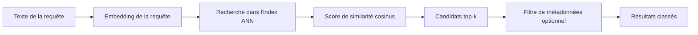

Vous avez 40 000 morceaux de documentation, un utilisateur pose une question très simple, et la recherche par mots-clés rate encore le passage qui répond vraiment. Lire chaque morceau serait correct, mais terriblement lent. La recherche vectorielle est le premier outil que je choisirais quand la formulation change, mais que le sens reste le même.

Un chunk, c'est simplement un petit morceau de document. L'astuce consiste à transformer chaque chunk, ainsi que la question de l'utilisateur, en embedding, c'est-à-dire une liste de nombres qui capture assez bien le sens pour comparer des textes par distance plutôt que par mots exacts. Le [guide OpenAI](https://platform.openai.com/docs/guides/embeddings) explique que les embeddings sont des vecteurs dont la distance reflète la parenté, et les [bases OpenSearch](https://docs.opensearch.org/latest/vector-search/getting-started/vector-search-basics/) montrent pourquoi cela permet de retrouver un sens proche, pas seulement des termes identiques.

Une fois les vecteurs prêts, il faut encore un moyen rapide de les parcourir. C'est le rôle d'un index, une structure de données conçue pour trouver les vecteurs les plus proches sans comparer chaque élément un par un. La [documentation FAISS](https://faiss.ai/) est utile ici parce qu'elle montre le mécanisme sans détour : on construit un index, on y ajoute des vecteurs, puis on cherche les voisins les plus proches.

C'est le pipeline que je garde en tête : on transforme d'abord la question en vecteur, l'index ANN réduit l'espace de recherche, puis on décide quels quelques candidats méritent vraiment de remonter. Le filtre de métadonnées est optionnel sur le papier, mais dans un vrai produit je traite le tenant, la langue ou la version du document comme une partie de la qualité de retrieval, pas comme un bonus.

C'est souvent à ce moment-là que les débutants se dispersent, et je garderais volontairement l'installation la plus simple possible. Si vous apprenez l'étape de recherche dans un système RAG, pour retrieval-augmented generation, vous apprenez la partie qui va chercher des passages sources avant que le modèle réponde. Un index FAISS local apprend généralement plus qu'une plateforme complète, parce que vous pouvez inspecter les résultats et voir quand le vrai problème vient d'un mauvais découpage ou de métadonnées absentes, c'est-à-dire des repères comme le titre, la source ou la date.

La recherche vectorielle a aussi ses limites, et les débutants gagnent à l'entendre tôt. Elle retrouve des passages qui paraissent proches sur le plan sémantique, mais elle ne vérifie pas qu'un passage est vrai, à jour ou complet. Si vous avez ensuite besoin d'un service managé autour de la même idée, les [docs Pinecone](https://docs.pinecone.io/guides/search/semantic-search) montrent le même principe avec des index de vecteurs denses, mais la partie difficile reste en amont, dans la qualité des chunks, les métadonnées et l'évaluation.

Ma règle de décision est simple : choisissez la recherche vectorielle quand les utilisateurs posent la même question de plusieurs façons, et gardez une recherche par mots-clés quand la formulation reste stable et que le corpus est assez petit pour être inspecté à la main. Si « proche » vous paraît encore mystérieux, lisez ensuite le guide sur les vecteurs et la distance avant de vous inquiéter des bases de données.
