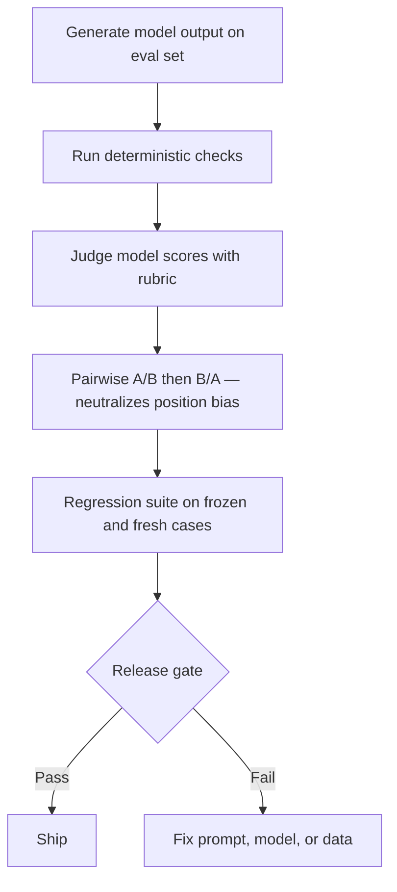

If you only spot-check ten outputs, regressions ship. If you replace that with one judge score and call it science, regressions still ship. Automated eval only starts paying rent when volume is high and release speed matters. Used badly, it just industrializes false confidence.

When I need to explain the pipeline to a team, I draw the flow before I argue about metrics:

## Start with hard checks

For anything tied to a release gate, I would start with deterministic checks. [OpenAI Evals](https://platform.openai.com/docs/guides/evals) is built around replayable datasets and repeatable runs, and [OpenAI graders](https://platform.openai.com/docs/guides/graders) make the split explicit between exact checks, similarity checks, and score-model graders. That is the right order. Use string, schema, and tool-call checks for hard requirements first. Reach for a judge model only after the cheap objective failures are already filtered out.

## Judge models need rubrics, not vibes

The reason teams keep using LLM-as-judge is simple: usefulness, instruction-following, and comparative quality are hard to score with plain rules. [G-Eval](https://arxiv.org/abs/2303.16634) is still the cleanest evidence that structured criteria improve alignment with human ratings. The lesson is not that the judge is smart. The lesson is that the rubric is doing real work. If you cannot write a rubric another reviewer could follow, do not automate that judgment yet.

## Pairwise beats absolute scores

Once you use a judge, I would choose pairwise comparison over 1-to-5 scoring almost every time. [MT-Bench](https://arxiv.org/abs/2306.05685) showed strong judge models can track human preference reasonably well, while also exposing position bias, verbosity bias, and self-enhancement bias. That is exactly why pairwise setups with swapped answer order are safer than neat-looking scalar dashboards. A tie plus a written reason is more useful than a fake-precise 4.2.

## RAG is where lazy evals lie

RAG systems break in two places: retrieval and answer generation. If you collapse those into one score, you learn almost nothing. [Ragas metrics](https://docs.ragas.io/en/stable/concepts/metrics/available_metrics/) separate answer relevance, context precision, context recall, and faithfulness because those failure modes are different and operationally useful. I would track retrieval metrics and answer metrics side by side, then inspect disagreements instead of averaging them into one executive-friendly number.

## Production is where the suite rots

The eval itself drifts. Prompts change, judge models get upgraded, the dataset goes stale, and the team quietly learns how to please the metric. So keep one frozen adjudicated set for trend lines, one rotating set from fresh failures, and basic observability on pass rate by task, judge disagreement rate, and score shifts after every model or prompt change. If you are not watching those three signals, the dashboard is decoration.

When I need the whole stack on one screen, this is the summary I actually use:

| Method               | How it works                                                    | Strength                                          | Limitation                                 |
| -------------------- | --------------------------------------------------------------- | ------------------------------------------------- | ------------------------------------------ |
| Deterministic checks | Enforce exact strings, schema shape, or tool-call behavior      | Cheap, repeatable, easy to gate releases with     | Misses softer quality questions            |
| Rubric-based scoring | Grade outputs against explicit criteria                         | Interpretable and easier to audit                 | A weak rubric gives you fake rigor         |
| Judge model          | An LLM applies the rubric at scale                              | Covers fuzzy qualities rules miss                 | Bias and model drift still leak in         |
| Pairwise comparison  | Rank two outputs against each other, ideally with swapped order | Strong preference signal with less fake precision | Does not give an absolute score            |
| RAG split metrics    | Track retrieval quality and answer quality separately           | Tells you where the system is actually failing    | More dashboards to maintain and interpret  |
| Regression suite     | Re-run frozen and rotating cases before release                 | Catches regressions over time                     | Needs continuous curation and adjudication |

## Decision rule

Automate anything you can replay cheaply and explain clearly. Use LLM judges only when a written rubric exists, answer order is randomized, and humans still audit a slice of results. If you cannot say which failure mode moved and why, the eval is not ready to protect an SLA.
